# Part 3: AWS Lambda Function Project

## 1. AWS Lambda Function: Add Two Numbers

## **Overview**

This AWS Lambda function accepts two numbers as input, adds them together, and returns the result. The function is designed with error handling to ensure that only valid numeric inputs are processed.

### Creating a new lambda function:

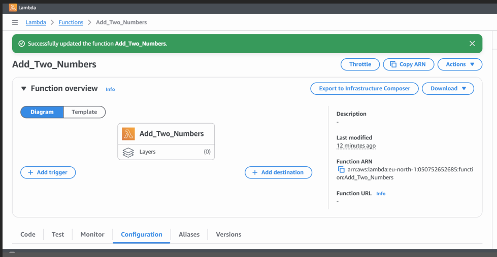

## Lambda Function Code (Python)

```

``import json

def lambda_handler(event, context):
    try:
        # Extract numbers from the event
        num1 = event.get('num1')
        num2 = event.get('num2')

        # Validate that both inputs are numbers
        if not isinstance(num1, (int, float)) or not isinstance(num2, (int, float)):
            raise ValueError("Both num1 and num2 must be numbers.")

        # Perform the addition
        result = num1 + num2

        # Return a successful response with the result
        return {
            'statusCode': 200,
            'body': json.dumps({
                'message': f'The result of adding {num1} and {num2} is {result}',
                'result': result
            })
        }

    except Exception as e:
        # Return an error response if input is invalid
        return {
            'statusCode': 400,
            'body': json.dumps({
                'message': str(e)
            })
        }
```

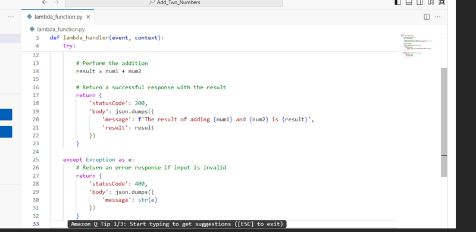

## Explanation of the Code

* **`lambda_handler`** : This is the entry point for AWS Lambda when the function is triggered.
* **`event.get('num1')` and `event.get('num2')`** : Extract the numbers from the input event.
* **Input Validation** : We check if both `num1` and `num2` are valid numbers (either integers or floats). If they’re not, an exception is raised.
* **Addition** : The numbers are added together, and the result is returned in the response body.
* **Error Handling** : If there is an error (e.g., invalid input), an error message is returned with a 400 status code.

### **Function Input**

The function expects the following input format in the event:

```
{
    "num1": 5,
    "num2": 3
}

```

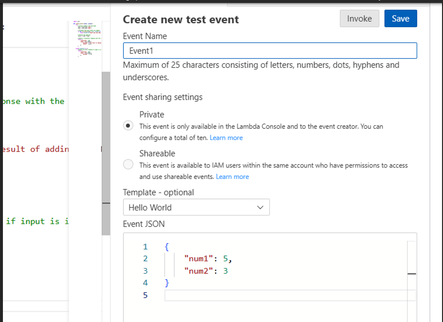

### **Function Output**

The Lambda function will return the sum of `num1` and `num2`. A successful response would look like:

```
{
    "message": "The result of adding 5 and 3 is 8",
    "result": 8
}

```

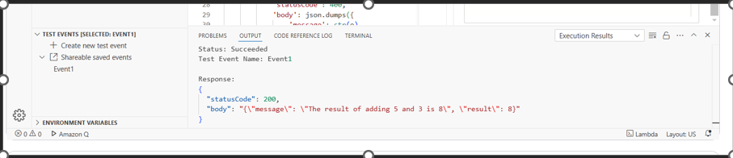

In case of an error (like invalid input), the response will look like:

```
{
    "message": "Both num1 and num2 must be numbers."
}

```

---

### **Test Cases**

**Test Case 1: Valid Numbers**

* **Input** : `{ "num1": 5, "num2": 3 }`
* **Output** :

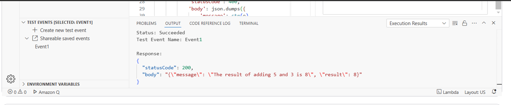

**Test Case 2: Negative Numbers**

* **Input** : `{ "num1": -5, "num2": 3 }`
* **Output** :

  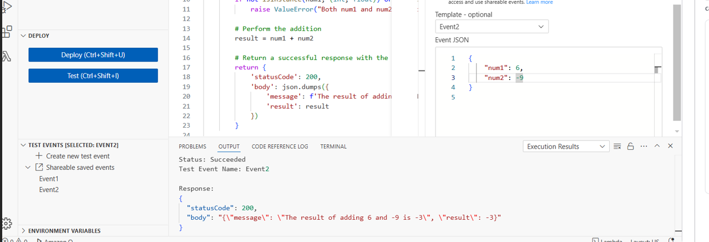

**Test Case 3: Invalid Input (Non-Numeric)**

* **Input** : `{ "num1": "6", "num2": -9 }`
* **Output:**

  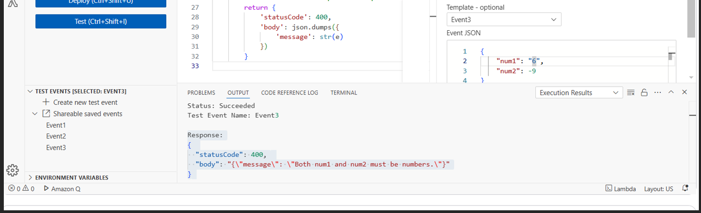

**Test Case 4: Missing Input**

**Input** : `{ "num1": 5 }` (no `num2` key)

**Output:**

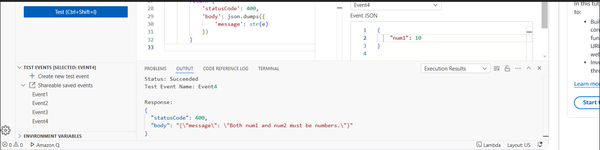

---

### **Error Handling**

**Input Validation** : The function validates if both `num1` and `num2` are numbers (integers or floats). If not, it throws an error with a message.

**Missing Input** : If `num1` or `num2` is missing, or if the input is not a number, the function returns an error message.

**General Errors** : Any unforeseen error is caught, and an appropriate error message is returned

---

### Documentation

#### **Overview**

- The function accepts two numbers and returns their sum.
- If invalid input is provided (e.g., missing parameters or non-numeric values), the function responds with an error message.

#### **Input and Output Format**

- **Input**: A JSON object containing two numbers:
  ```json
  { "num1": <number>, "num2": <number> }
  ```
- **Output**: A JSON object containing the sum and a message:
  ```json
  { "message": "<message>", "result": <sum> }
  ```

#### **Test Cases**

- Provided test cases to ensure that the Lambda function behaves as expected for various scenarios (valid inputs, invalid inputs, etc.).

#### **Error Handling**

- The function checks for valid numeric inputs and handles errors gracefully, providing clear error messages for invalid input.

#### **Security**

- The function ensures that only valid data is processed by validating input.
- It’s always a good practice to limit Lambda permissions to only what’s necessary. Since no external resources are needed here, the basic Lambda execution role should suffice.

---

# 2. AWS Lambda Function to Store a Document or PDF File in S3 Bucket

## Overview

This document outlines the design and implementation of an AWS Lambda function that uploads a document or PDF file to an S3 bucket. The function handles input validation, error handling, and logging to ensure robust performance.

## Components

### 1. Lambda Function Creation

* **Handler Function** : The main entry point that processes the incoming event and uploads the file to S3.
* **Boto3** : AWS SDK for Python, used to interact with S3.
* **Environment Variables** : Used to store the S3 bucket name securely.

  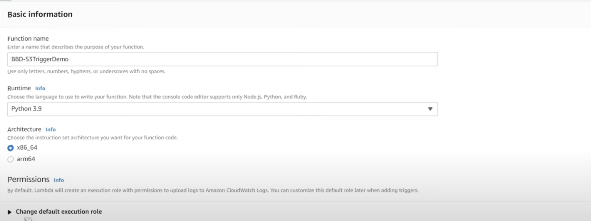
* 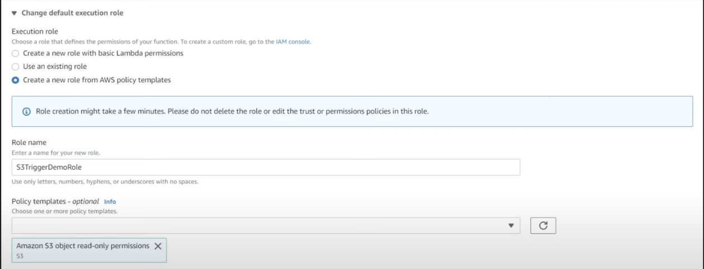

### 2. S3 Bucket

* A pre-configured S3 bucket where the files will be uploaded.

### 3. Event Parsing

* The function expects a base64-encoded file in the event body and a file name in the headers.

## Lambda Function Code

```python
import json
import boto3
import csv
import io

s3Client = boto3.client('s3')

def lambda_handler(event, context): 
    #Get our bucket and file name
    bucket = event['Records'][0]['s3']['bucket']['name']
    key = event['ReoLjds'][0]['s3']['object']['key']
  
    print(bucket)
    print(key)
  
    #Get our object 
    response = s3Client.get_object(Bucket=bucket, Key=key)
  
    #Process it
    data = response['Body'].read().decode('utf-8')
    reader = csv.reader(io.StringlO(data))
    next(reader)
    for row in reader: 
        print(str.format("Year - {Year, Mileage - Price - {}", row[0], row[1], row[2]))
```

## Environment Variables

* **S3_BUCKET** : Name of the S3 bucket where files will be uploaded.

## Deployment Instructions

1. **Create an S3 Bucket** : Ensure an S3 bucket is created and the name is noted.
2. **Set Up IAM Role** :

* Create an IAM role with `AWSLambdaBasicExecutionRole` and S3 `PutObject` permissions.

**Deploy the Lambda Function** :

* Use the AWS Management Console or AWS CLI to deploy the function.
* Set the `S3_BUCKET` environment variable with the bucket name.

**Test the Function** :

* Use sample events to test the function through the AWS Console or API Gateway.

  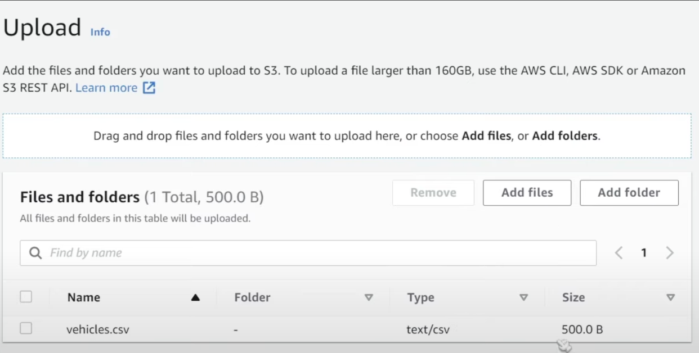

## Sample Event Payload

```json
{
    "body": "<base64-encoded file content>",
    "headers": {
        "filename": "test_document.pdf"
    }
}
```

## Security Considerations

* **Minimal Permissions** : Ensure the Lambda function role has minimal permissions required to interact with S3.
* **Input Validation** : Validate file type and size to prevent unauthorized uploads.

## Logging and Monitoring

* **Logging** : Logs are configured to capture key events and errors.
* **Monitoring** : Use AWS CloudWatch to monitor function execution and performance.

## Additional Enhancements

* **Input Validation** : Additional checks for file size.
* **Error Handling** : More detailed error messages and handling.
* **Documentation** : Comprehensive comments and a `README` file.

## README File

### Setup Instructions

1. **Deploy the Lambda Function**
   * Follow the deployment steps provided above.
2. **Environment Variables**
   * Set the `S3_BUCKET` environment variable in the Lambda configuration.

### Usage

* The function can be triggered via API Gateway, passing the file content as a base64-encoded string in the request body.

### Example Test Event

* Use the sample payload provided above to test the function.

### Monitoring and Logs

* Check CloudWatch logs for detailed execution information and troubleshooting.

### Security

* Ensure the Lambda execution role follows the principle of least privilege.

---
