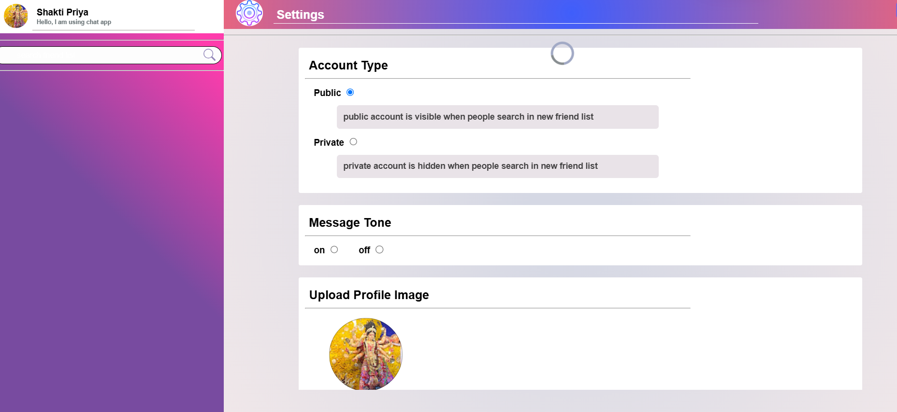

# Internship-Project

## Part 1: Frontend Development - Responsive Webpage

## Overview

This project involves creating a responsive webpage that adjusts to different screen sizes. The layout consists of a fixed navbar, a collapsible left menu, a main content area, and a right-side panel. A footer is included at the bottom of the page. Additionally, JavaScript functionality is implemented to adjust the page’s width based on screen width.

## Features

- **Fixed Navbar**: The navbar remains fixed at the top of the page even when the user scrolls.
- **Responsive Layout**:
  - **Left Menu**: A collapsible menu on the left side.
  - **Main Content Area**: The central area where the main content is displayed.
  - **Right-Side Panel**: A panel on the right for additional content or features.
- **Footer**: A footer section fixed at the bottom of the page.
- **Dynamic Page Resize**: JavaScript function to shrink the page based on screen width:
  - Screen width between 992px and 1600px → Shrink to 90%.
  - Screen width between 700px and 767px → Shrink to 80%.
  - Screen width between 600px and 700px → Shrink to 75%.
  - Screen width ≤ 600px → Shrink to 50%.

---

## Setup Instructions

1. **Clone the repository**:

   ```bash
   git clone <repository-url>
   cd <repository-directory>
   ```
2. **Install dependencies** : No external dependencies required for the frontend part. The project uses basic HTML, CSS, and JavaScript.
3. **Open the project** : Open `index.html` in any modern web browser.
4. **Adjusting page size** :  Resize your browser window to see the page shrinking according to the screen width.

---

## Folder Structure

/project-root

    - index.html

    - main.js

    - style.css

    - README.md

---

## Technologies Used

* HTML5
* CSS3
* JavaScript (for the responsive functionality)

---

---

# Part 2: Django Chat Application

***Hosted website Link:  https://myultimateapp-chat-app.onrender.com/login***

This project is a real-time chat application that allows users to sign up, log in, view a list of registered users, and chat with other users. The app features a user-friendly interface with WebSocket support for instant communication. All user data and chat messages are stored in a database, and previous messages can be retrieved and displayed in the chat interface.

## Features

- **User Authentication**

  - Users can sign up and log in to the chat application.
- **User List**

  - All registered users are displayed in a collapsible left menu for easy navigation.
- **Real-Time Chat**

  - The logged-in user can select any other user from the menu and initiate a chat.
  - WebSocket is used to provide real-time messaging functionality.
- **Message History**

  - All messages are stored in the database, and users can view previous conversations.
- **Database Integration**

  - Chat messages and user data are stored and retrieved from a database, ensuring data persistence.
- **User-Friendly Interface**

  - The chat interface is designed to be intuitive and functional, offering a smooth user experience.

## Tech Stack

- **Frontend:**

  - HTML, CSS, JavaScript
  - WebSocket for real-time messaging
  - Responsive design for various screen sizes
- **Backend:**

  - Python (Django or Flask for API development)
  - WebSocket support via Django Channels or similar
- **Database:**

  - SQLite / PostgreSQL (or any preferred database)

## How to Setup

### 1. Clone the repository

```bash
git clone https://github.com/your-username/chat-application.git
cd chat-application
```

### 2. Install dependencies

For frontend dependencies:

```bash
npm install
```

For backend dependencies (if using Python and Django):

```bash
pip install -r requirements.txt
```

### 3. Set up the database

Ensure your database is set up and configured in settings.py (for Django) or equivalent. If using Django, run migrations:

```bash
python manage.py migrate
```

### 4. Start the server

Run the development server for backend:

```bash
python manage.py runserver
```

For frontend:

```bash
npm start
```

---

## Usage

#### Sign Up / Log In:

Create a new account or log in with your credentials.

#### View Users:

Once logged in, the left menu will display all registered users. You can click on any user to start a chat.

#### Start Chatting:

Select a user and begin chatting. Messages will be sent in real-time via WebSocket.

#### Message History:

Previous messages will automatically load when you start a new chat with any user.

## 📷 Screenshots:

### Login Page


### Profile Update Page



### Chat Screen


---

# PART 3: AWS ASSIGNMENT:

For part 3 do visit the README.md file of AWS_assignment folder .
